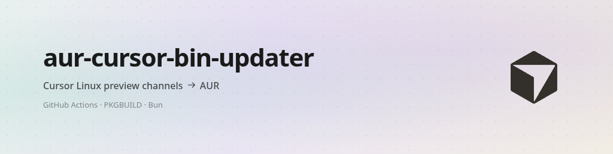

<p align="center">
  <picture>
    <source media="(prefers-color-scheme: dark)" srcset="assets/banner-dark.png" />
    <source media="(prefers-color-scheme: light)" srcset="assets/banner-light.png" />
    
  </picture>
</p>

[](https://aur.archlinux.org/packages/cursor-early-access-bin)
[](https://aur.archlinux.org/packages/cursor-nightly-bin)

[](https://github.com/AugusDogus/aur-cursor-bin-updater/actions/workflows/update-aur-early-access.yml)
[](https://github.com/AugusDogus/aur-cursor-bin-updater/actions/workflows/update-aur-nightly.yml)

## Install

```bash
paru -S cursor-early-access-bin   # prerelease channel
paru -S cursor-nightly-bin        # dev / nightly channel
```

## What it does

|               |                                                                      |
| ------------- | -------------------------------------------------------------------- |
| **Tracks**    | Cursor’s update API: `prerelease` (early access) and `dev` (nightly) |
| **Updates**   | Version, commit, and `.deb` checksum in each channel’s PKGBUILD      |
| **Publishes** | On `main`, pushes to the AUR; on `development`, stops before publish |
| **Schedule**  | Hourly workflows (manual dispatch supported)                         |

PKGBUILDs live under `packaging/` and are versioned in git for review.

## CLI

Requires [Bun](https://bun.sh/). From the repo root:

```bash
bun scripts/update.ts --check --channel early-access
bun scripts/update.ts --update --channel nightly
bun scripts/update.ts --srcinfo --channel early-access
```

Run `bun scripts/update.ts --help` for additional flags.

## Repository layout

| Path                                 | Role                                             |
| ------------------------------------ | ------------------------------------------------ |
| `.github/workflows/update-aur-*.yml` | CI: check, commit, AUR publish                   |
| `scripts/update.ts`                  | Updater entrypoint                               |
| `scripts/schemas.ts`                 | Zod schemas for API / check output               |
| `scripts/lib/`                       | API client, PKGBUILD handling, channels          |
| `packaging/<channel>/PKGBUILD`       | Source of truth per AUR package                  |
| `packaging/common/`                  | Shared `cursor.desktop` and `cursor-launcher.sh` |

## Packaging

Installs the upstream `.deb` **without** replacing bundled Electron or Node—same general idea as [`cursor-ide-bin`](https://aur.archlinux.org/packages/cursor-ide-bin). Optional flags: `~/.config/cursor-flags.conf` (one flag per line; see `packaging/common/cursor-launcher.sh`). `chrome-sandbox` gets the setuid bit when present.

## Acknowledgments

- [lone-cloud/cursor-ide-bin](https://github.com/lone-cloud/cursor-ide-bin)
- [Gunther-Schulz/aur-cursor-bin-updater](https://github.com/Gunther-Schulz/aur-cursor-bin-updater)
